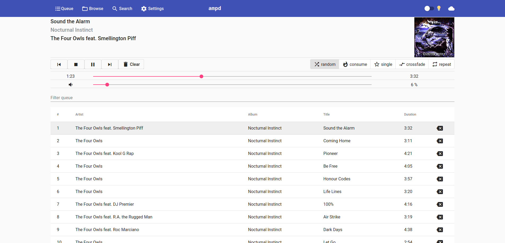
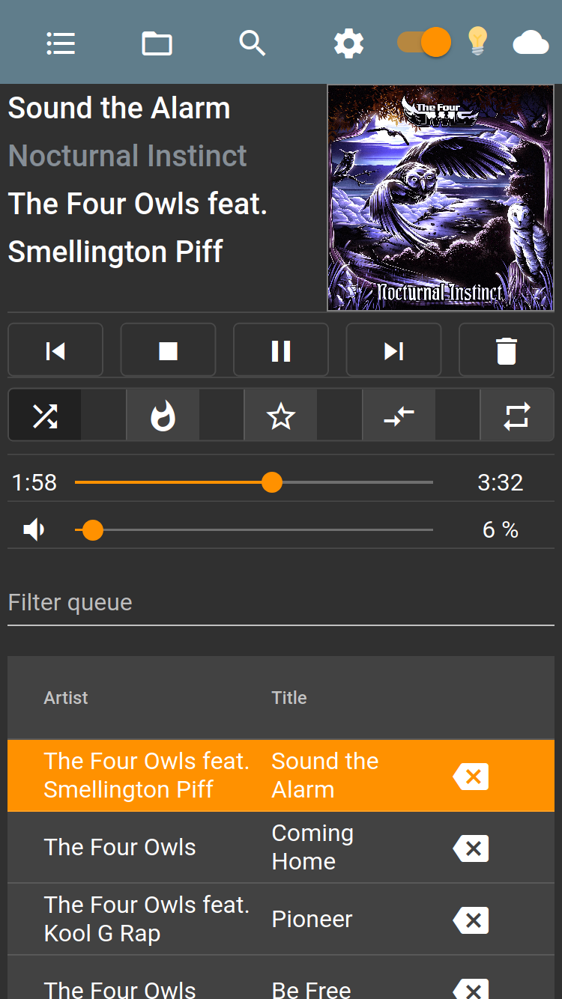

# ampd

ampd is a web-based client for [MPD](https://www.musicpd.org/). It is build with `Angular` and `Spring Boot`.


## Screenshots

Desktop (dark theme)             |  Mobile (light heme)
:-------------------------:|:-------------------------:
  |  
 
## Running

Requires Java 11. To run ampd, just run the `jar`-file:
```
java -jar ampd.jar
```

Additional options can be passed via the `-D` arguments, for example:
```
# ampd shoult listen on port 8082
java -jar -Dserver.port=8082 ampd.jar
# Music dir is located at /home/foo/music
java -jar -Dmpd.music.directory=/home/foo/music ampd.jar
# MPD runs on port 5500
java -jar -Dmpd.port=5500 ampd.jar
# Combine multiple properties, listen only on localhost and access MPD server on 'myhostname'
java -jar -Dserver.address=localhost -Dmpd.server=myhostname ampd.jar
```
To persist these options, create a config file. See chapter `Installation`.

# Using
## Shortcuts

`ampd` has some shortcuts built in:

 * `<space>` or `p`: Pauses the current running song. If the browser focus is on another button, that button may also be triggered.
 * `<arrow right>` Next song. If you previously set the volume with the mouse, the shortcut may instead *increase* the volume.
 * `<arrow left>`: Previous song. If you previously set the volume with the mouse, the shortcut may instead *decrease* the volume.
 * `f`: Sets the focus to the filter. This is enabled on both the `Queue` and `Browse` view.
 * `1`: Navigate to the queue view
 * `2`: Navigate to the browse view
 * `3`: Navigate to the search view
 * `4`: Navigate to the settings view
 
 ## Installation
 
 Download a release from [here](https://github.com/rain0r/ampd/releases) ([mirror](https://static.hihn.org/dl/ampd/)).
 
 Since `ampd` is distributed as a single `jar`-file, it doesn't need a traditional installation. 
 Just copy it wherever you like. I would recommend `/opt/ampd/ampd.jar`. 
  
 To overwriter any property from `application.properties` you can place a config file under `/opt/ampd/ampd.conf` which contains additional parameters, for example:
 
 ```
 # File: /opt/ampd/ampd.conf
 # See src/main/resources/application.properties for a full list
 JAVA_OPTS="-Dspring.profiles.active=prod"
 # If you have multiple JRE installed 
 JAVA_HOME="/opt/openjdk-bin-11.0.6_p10/" 
 ```
 
 ### Caveats  
 The properties in `ampd.conf` are only applied if... 
 
  - ...`ampd` is startet via `./ampd.jar start`
  - ... the `conf`-file has the same name as the `jar`-file (except the ending, of course) 
 
 ### Installation as a service
 #### init.d
 The jar file can be used as a service out-of-the-box. Just create a symlink to `/etc/.init.d` and you're good to go:
 ```
 ln -sf /opt/ampd/ampd.jar /etc/init.d/ampd
 /etc/init.d/ampd start
 ```
 #### systemd
 Create the file `/etc/systemd/system/ampd.service`
 ```
 [Unit]
 Description=ampd
 After=syslog.target
 
 [Service]
 User=ampd # <<<--- Change to a user on your system 
 ExecStart=/opt/ampd/ampd.jar
 SuccessExitStatus=143
 
 [Install]
 WantedBy=multi-user.target
 ```
 Afterwards, enable it with `systemctl enable myapp.service`.