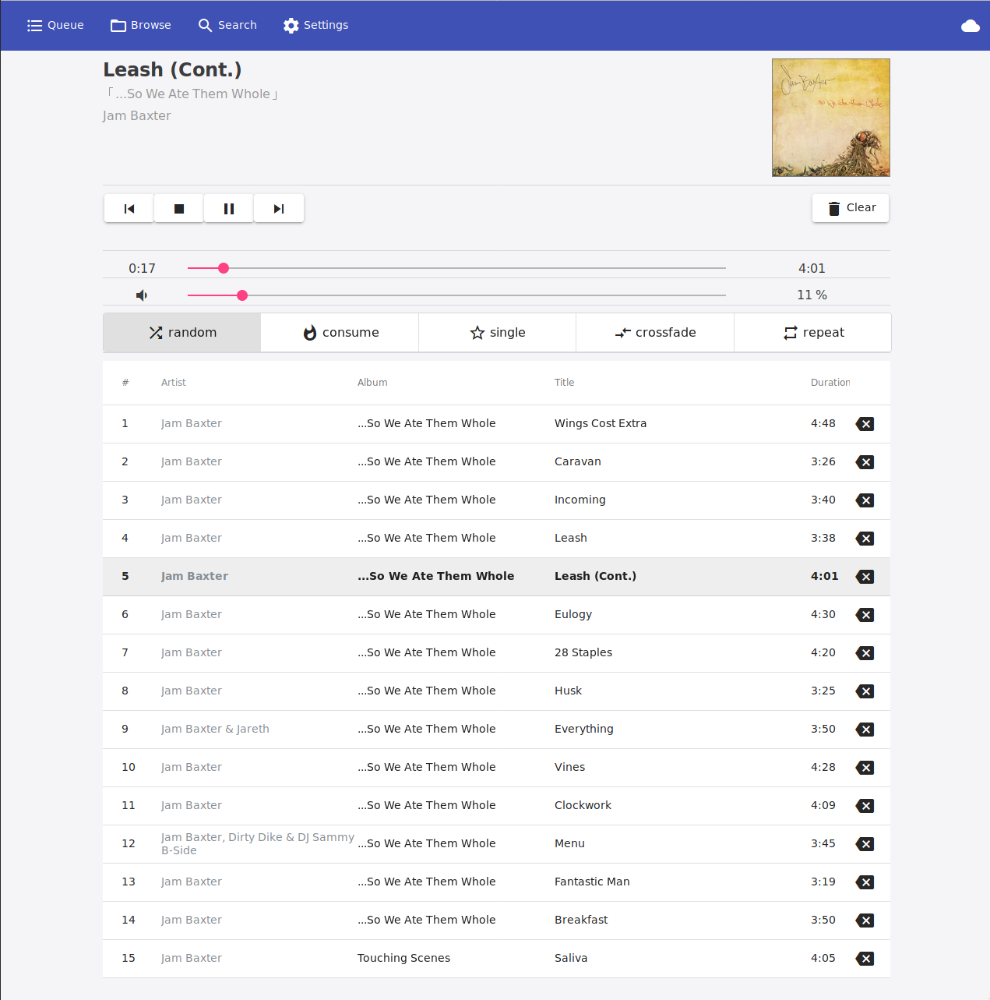

# ampd



ampd is a web-based client for MPD. It is build with Angular and Spring Boot.

## Running

To run ampd, just execute the jar-file:

```
java -jar server-0.0.1-SNAPSHOT.jar
```

Additional options can be passed via the `-D` arguments, for example:

```
java -jar -Dserver.port=8082 server-0.0.1-SNAPSHOT.jar
```

For a full list of options, see [`application.properties`](src/main/resources/application.properties)

## Building

Set `AMPD_URL` to the url of your server in `angularclient/src/environments/environment.prod.ts`:

```
const AMPD_URL = 'punica:8003';
```

Build Angular:

```
cd angularclient
npm install
npm run build-prod
```

Open `src/main/resources/application.properties` and fill in the address of your MPD server, the path to your music files, listening port etc.

Build the jar file:

```
cd ..
mvn clean package spring-boot:repackage
```

Start it!

```
java -jar target/server-0.0.1-SNAPSHOT.jar
```

Every property from `src/main/resources/application.properties` can be overwritten by command line aruments:

```
java -jar -Dserver.port=8082 target/server-0.0.1-SNAPSHOT.jar
```

## Developing

Formatting the Angular source-code:

```
cd angularclient
npm run format
```

Tagging a new version:

```
mvn release:prepare
```